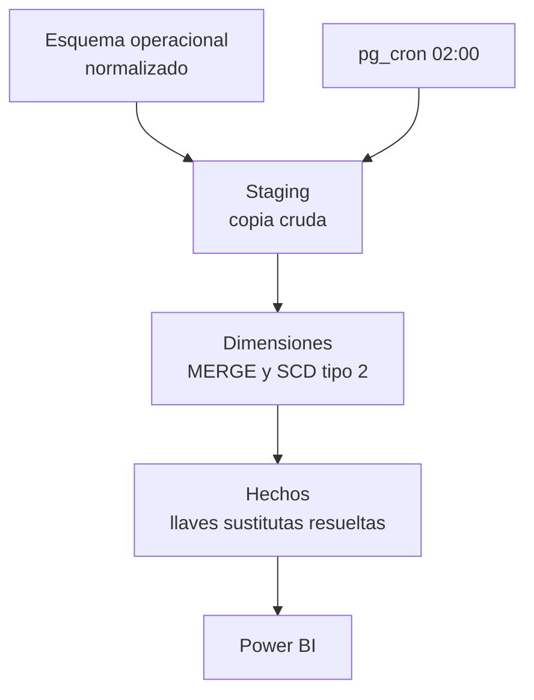
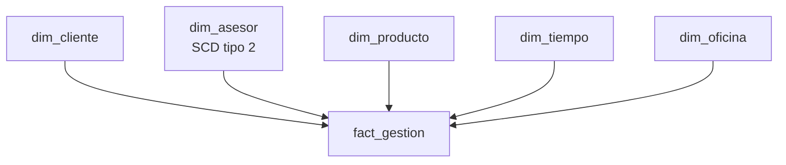

# Warehouse dimensional de créditos

Del sistema operacional al modelo estrella: cómo se transforma una base
normalizada de colocación de créditos en un warehouse que el negocio puede
consultar sin pedirle nada a un desarrollador.

> **Estado:** en construcción. Ver [avance](#avance).

---

## El problema

Una institución de microfinanzas reparte leads pre-aprobados entre asesores
de ventanilla. Cada contacto queda registrado, y el lead que convierte
termina en un desembolso.

La base que soporta esa operación está normalizada: evita duplicados y
responde rápido a una escritura. Pero no sirve para responder preguntas como:

- ¿Cuál es la tasa de conversión por asesor, por mes y por producto?
- ¿Cuánto se colocó en la oficina de San Isidro **en el momento en que
  el asesor trabajaba ahí**, no donde está hoy?
- ¿Cuántos contactos hacen falta, en promedio, para cerrar un desembolso?

Contestar eso contra el modelo operacional exige uniones costosas y, en el
caso de la segunda pregunta, es **imposible**: el sistema sobrescribe la
oficina del asesor cuando se traslada y pierde la historia.

## La solución

Un warehouse dimensional en esquema estrella, poblado por una carga
incremental idempotente, con la historia de los atributos preservada
mediante dimensiones de cambio lento tipo 2.

---

## Arquitectura



### Modelo estrella



**Granularidad del hecho:** una fila por gestión registrada.

Se eligió la granularidad más fina disponible. Desde ahí se puede agregar
hacia arriba — por día, por asesor, por producto — mientras que desde un
grano grueso el detalle ya no se recupera.

---

## Decisiones de diseño

| Decisión | Qué se eligió | Por qué |
|---|---|---|
| Granularidad | Una fila por gestión | Lo más fino disponible; agregar es reversible, perder detalle no |
| Esquema | Estrella, no copo de nieve | Menos uniones por consulta; el espacio extra es irrelevante a esta escala |
| Historia del asesor | SCD tipo 2 | Sin ella, las gestiones de enero se atribuirían a la oficina actual |
| Llaves | Sustitutas enteras | Permiten varias versiones de la misma persona y hacen las uniones más baratas |
| Carga | `MERGE` sobre staging | Idempotente: correrla dos veces no duplica |
| Programación | `pg_cron` dentro de Postgres | Sin orquestador externo para un alcance de este tamaño |
| Base de datos | PostgreSQL en Docker | Reproducible en cualquier máquina y sin costo de nube |

---

## Cómo levantarlo

Requisitos: Docker Desktop.

```bash
cp .env.example .env        # y pon tus propias claves
docker compose up -d --build
```

Esto levanta:

| Servicio | Dónde | Para qué |
|---|---|---|
| PostgreSQL 16 + pg_cron | `localhost:5433` | La base |
| pgAdmin | `http://localhost:5050` | Cliente web |

Después, en orden:

```bash
# 1. esquema de origen
docker exec -it wh-creditos-db psql -U <usuario> -d wh_creditos -f /sql/01_fuente_operacional.sql

# 2. datos de prueba (semilla fija: siempre genera lo mismo)
python scripts/generar_datos.py
```

El generador produce **600 leads, 15 asesores en 9 oficinas, ~2.000 gestiones
y ~120 desembolsos** repartidos entre enero y setiembre de 2026, con una tasa
de conversión del 20% y S/ 1,8 millones colocados.

Los datos no se versionan: se versiona el generador. Así el repositorio queda
liviano y cualquiera reproduce exactamente el mismo conjunto.

Para simular un traslado de personal y poner a prueba el SCD tipo 2:

```bash
python scripts/generar_datos.py --traslados
```

Para apagarlo sin perder los datos: `docker compose stop`.
Para borrar todo, volúmenes incluidos: `docker compose down -v`.

---

## Estructura

```
.
├─ docker-compose.yml     Postgres + pgAdmin
├─ Dockerfile             Postgres 16 con pg_cron
├─ sql/                   Los scripts, en orden de ejecución
├─ docs/                  Modelo, diccionario de datos, cuaderno de errores
├─ datos/                 CSV de origen (ignorados por git)
└─ powerbi/               El tablero final
```

---

## Avance

- [x] Entorno reproducible con Docker
- [x] Esquema operacional de origen
- [x] Datos de prueba reproducibles
- [x] Capa de staging con marca de agua
- [x] Dimensiones con SCD tipo 2
- [ ] Tabla de hechos
- [ ] Carga incremental en procedimientos
- [ ] Programación con pg_cron
- [ ] Índices y medición de planes de ejecución
- [ ] Diccionario de datos
- [ ] Tablero en Power BI

---

## Seguridad

Las credenciales viven en `.env`, que está en `.gitignore` y nunca se sube.
El repositorio incluye `.env.example` con la forma del archivo, sin valores
reales.

---

Axel Daniel Fuentes · [LinkedIn](https://linkedin.com/in/afuentes12) · [GitHub](https://github.com/Axel12fuentes)
